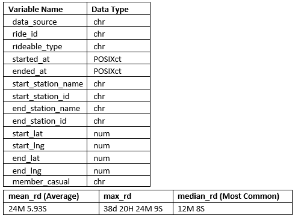

# Odmandakh's Portfolio

# About me
### My Background
My name is Oddie I’m out there and I wear my heart on my sleeve, coming from Mongolia to the UK at 9. I’ve had to tough it out and find my way. Always looking to improve my skillset and bring real value. I need to know that I have made your job easier and brought value to you or I won’t be satisfied with my work.

Let’s Jump on an initial 10-minute call (free of charge), so that we can discuss your project in more detail and identify how my skillset will work best for you and provide immense value to your organization as well. 

#### Phone: +44 7881046478
#### Email: OD.Jamiyansuren@gmail.com
#### Linkedin:  [https://www.linkedin.com](https://www.linkedin.com/in/odmandakh-jamiyansuren-05519b139/)

### Who am I?
If you don’t find me working out your gonna find me nerding out about the world. Knowing our history and a good story is all I live for. Exploring the hidden world inside a page or a dataset that only you can see is one of the most exhilarating things to me. Yes, I’m going to want to tell you all about it if I find something really interesting so we can be amazed and nerd out together.

## My Credentials

### [Pricing at Funko](https://funkoeurope.com/)

* I manage and ensure the data integrity for Pricing at Funko Europe.
* I use Excel & SQL Server to manipulate and clean Funko's pricing data, ensuring that pricing in Funko is as efficient as possible for all of Funko’s 1,000s of customers and 10,000s products. Lowering response times from 2 weeks to 2-3 days!
* Analysed the current Pricing data for Senior Management and sales managers, creating data visualisations, pivot tables and found key opportunities in FOB, Ex works and customer pricing saving £1,000,000s!
* Created pricing templates to streamline pricing processes for the entire Sales & CS department. Using Excel’s VBA coding, Pivot tables, vlookups and calculations with iferror statements. Lowered the number of back and forth emails to 1. 
* Due to the nature of pricing I manage the data for all our customers, managing stakeholder relations in the entire department for sales, finance, order-entry, Customer Services, Product and Softline. 

### University of Greenwich, MSc Economics & Finance, Distinction

* Using OLS regression models with panel data created an economic model measuring the link between economic growth and national currencies. Was able to create a model that was statistically significant and homoscedastic.

### Google's Data Analytics Professional Certificate, [Verify](https://www.credly.com/badges/b5ceea7a-31c6-4f30-b732-50d35219b46f?source=linked_in_profile)

* Completed extensive six month job-ready Google Career Certificate training. Demonstrated hands-on experience with data cleaning, data visualisation, project management, interpreting and communicating data analytics findings. Confidence in transforming complex data into actionable and clear insights. Fluency in computer languages and a solid understanding of databases.

# Projects
# [Converting Casual Riders to Members Riders: Chicago Bike Data](https://github.com/Offthecharts89/Chicago-Bike-Data-Project)

## Summary
* Working with dataset with 100 million datapoints.  
* Tasked by the marketing team of Cyclistic to do an exploratory analysis of their user’s bike data. 
* Giving recommendation from my analysis of how Cyclistic can convert their casual users to full members to increase revenue, as it was previously concluded by Cyclist’s finance team that member riders are the bulk of their revenue and that they should increase the number of member riders.
* My analysis was that casual riders value fun, warm weather and the weekends. Casual riders go on longer rides on average and median. While members are more consistent. Going to work, they use it as a mode of transportation. 
* I advised the marketing team to create a weekend and summer deal. We can have them as bi-annual members or weekend member. This will create a sales funnel for casual riders to eventually become full members. 
* I gave further recommendations to market the warm weather and having fun, as casual riders value these metrics the most, using social media, their own built in app and on their bikes. 
* (For the full report you can click the title)

### Aggregated the data and performed calculations to find relationships or trends.

Visualized the data in weeks and months. Found a trend that there would be a surge in rides over the weekend and in the summer months 
  

### Compared casual riders to member riders to understand the difference between them.

caual riders ride longer in all metrics

Compare months

Casual Riders are much more seasonal in their behaviour. The weather plays a big factor for them as casual rider dip below the bar in the winter months and even pass the bar in the summer months. While member riders are much more consistent. They stay within the bars for most of the year. I can also confidently say that creating a summer package for casual riders to enjoy will boost the companies revenue by creating bi-annual members that can lead onto to becoming full members in the future. 

## Top Three Recommendations

* Create a weekend and bi-annual members package for casual riders to use. This will affectively make them half members.
* Market their riders for fun and warm weather. Casual riders seem to value these metrics the most.
* Use social media, their own built in app and their bikes to promote the deal. 

# [Master's Dissertation on Economic Growth and National Currencies](https://github.com/Offthecharts89/Master-s-Dissertation-On-Economic-Growth-National-Currencies)

## Summary

* created and wrote the code for economic models using panel data, running a OLS linear regression. Also used Pivot tables to find relationships and trends between the two nations economic performance.   
* Researching the current literature and  on the current account balance and national currencies on economic growth in the UK and Japan.
* Concluding that economies would have to have an approach that would limit large fluctuations in their current account balance and their exchange rates themselves, rather than having a policy that can absorb the shocks.
* Achieved a Model that was Statistically significant and homoscedastic
* (For the full report you can click the title)

### Research Question

Would Stabilizing National Currencies Link to Higher Economic Growth?

### Model Specification

My plan was to compare the two countries of the United Kingdom and Japan. In terms of their GDP per capita and how sensitive their economies are to current account and exchange rate shocks. 

### Empirical Results
I ran a pooled OLS with lag independent variables to solve for the autoregression problem. My first model I had put all my independant variables to a lag of 1. I came up with some interesting results. I later decided to run a robust regression to lower the influence of any outliers in my data and resulted in a higher R-squared value. 

#### Test for Heteroskedasticity & Normality

When testing for heteroskedasticity, the model got a 0.8284. I reject the null hypothesis making my data homoscedastic. The variance in my data is around the same finite value allowing me to move on with my data. I got a .6697, I reject the null hypothesis, making my data normal. I tested for normality to see if my data set is well modelled by a normal distribution and to check if to see if any of the random variables underlying the data set are normally distributed. It is the random error in the relationship between the independent variables and the dependent variable in a regression model.

#### Looking at GDP per Capita for Each Country

(Y-axis in millions, International Monetary Fund, 2021)
Even with the UK’s population steadily increasing. The GDP per capita has increased by 373.87% in the past 30 years with only a small dip in 2008. The Japanese has had growth in GDP per capita of 198.52% over the past 30 years. With a population on the slow decline in past few years. The UK outperformed Japan in terms of growth by 175.35%. Even with its larger initial population of 121 million compared to the UK’s 56 million.

## Conclusion
From the data analysis it was shown that even though the Japanese economy was less sensitive to fluctuations in their national currency as compared to the UK. Japan has faced a larger amount volatility in their growth with Japan falling into recession quiet frequently when compared to the UK. This has led to the conclusion that economies would have to have an approach that would limit large fluctuations in their current account balance and their exchange rates themselves rather than a having a policy that can absorb the shocks. A preventative measure to keep exchange rates and current account balance from being overly volatile seems more beneficial in the long term.  

# [Creating a Dashboard for a HR Company in the UK](https://github.com/Offthecharts89/Dashboard-for-a-HR-Company)

## Summary
* Was tasked to create an interactive dashboard from last year's data on cases.
* Asked to remain anonimous but was very kind and let me show the work I had done for them.
* Scrubbed, cleaned and created a Dashboard using pivot tables 
* (To download the excel file, you can click the title)

#### Dashboard:

This Project was designed to be client facing. The client asked for a interative dashboard to give a summary of Janurary 2020 to October 2020 case data. Created Pivot tables to identify trends and relationships for 'time taken to close a case,' 'types of cases closed,' 'the best performing divisions' and revenue trends for the past 3 months. Noticed most cases were closed within the first week and the 2 most popular services offered by tge company was Absences and Probations.
#### Raw Data:

Data was cleaned and scrubbed to protect company and individual identifing information. All tasks were performed in Excel.
